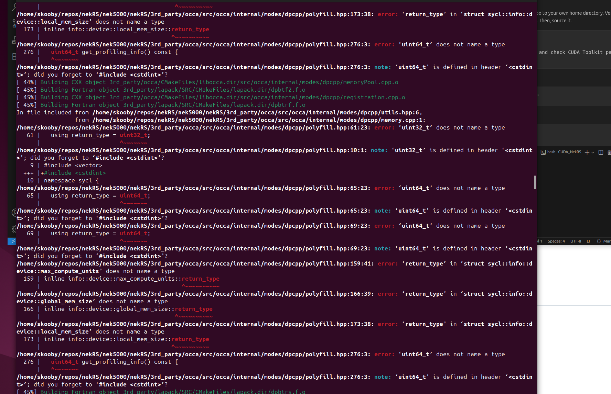

# Support Documentation for CUDA NekRS Installation on Ubuntu

Test specs are RTX 3090 Ti GPUs, i9-12900KS chipset on ASUS Z690 motherboard. These steps should work with most gaming and laptop PCs with an Nvidia GPU.

### 1. Install Ubuntu 24.04.3

1) Inside your Windows instance, download the Ubuntu 24.04.3 iso file

   Go to https://ubuntu.com/download/desktop and click the green button

2) Use Rufus (or Ventoy for multi-image usb sticks). Follow these directions:
  
    https://ubuntu.com/tutorials/create-a-usb-stick-on-windows

3) From your BIOS, boot from the USB drive and install to the target drive

     You may choose "Install latest Graphics and Wifi hardware drivers" during the install.

### 2. Install CUDA Drivers (if not pesent) and CUDA Toolkit (under version 13.0)

If you are unsure if or what Driver and CUDA Version you have, open a terminal and type:

    nvidia-smi

If you have a one, you'll get back something like:

    +-----------------------------------------------------------------------------------------+
    | NVIDIA-SMI 570.172.08             Driver Version: 570.172.08     CUDA Version: 12.8     |
    |-----------------------------------------+------------------------+----------------------+
    | GPU  Name                 Persistence-M | Bus-Id          Disp.A | Volatile Uncorr. ECC |
    | Fan  Temp   Perf          Pwr:Usage/Cap |           Memory-Usage | GPU-Util  Compute M. |
    |                                         |                        |               MIG M. |
    ...
In the example, Driver Version is 570.172.08 and CUDA Version is 12.8. This is good. Anything under CUDA Version 13 is not a problem. 

There is a difference between CUDA Version and Toolkit Version, even though they are usually the same numbers. The CUDA Version relates to the driver software you have running a particular GPU device on your machine. Meanwhile, your CUDA Toolkit's Version determines what hardware architectures a codebase on your machine is able to target. 

The NekRS codebase targets the compute-70 (CUDA Version 7) architecture in some sections. However, the lowest the Version 13 Toolkit will go is CUDA Version 7.5. So, we need a CUDA Toolkit Version below 13 to successfully build NekRS with minimal changes to the code.

In a terminal, type:

    wget https://developer.download.nvidia.com/compute/cuda/repos/ubuntu2404/x86_64/cuda-keyring_1.1-1_all.deb
    sudo dpkg -i cuda-keyring_1.1-1_all.deb
    sudo apt update

If you have a Driver Version < 13, just type:
    
    sudo apt install cuda-toolkit

However, if you have a Driver Version 13 or later, apt install will automatically install the Version 13 CUDA Toolkit as well (which won't work for NekRS) So if your driver's CUDA Version is 13 or higher, do this instead:

    sudo apt install cuda-toolkit-12-8

### 3. Folder Topology

Create a folder called repos, and clone each tool into their respective subfolders. 

    mkdir repos
    cd repos
    git clone https://github.com/openucx/ucx.git
    git clone --resursive https://github.com/open-mpi/ompi.git
    git clone https://github.com/libocca/occa.git
    git clone --recursive https://gitlab.kitware.com/paraview/paraview.git

Create a separate top-level folder for multiple copies of nekRS:
    
    mkdir nekRS && cd nekRS
    mkdir nek5000 && cd nek5000
    git clone https://github.com/Nek5000/nekRS.git
    cd .. && mkdir JezSw && cd JezSw
    git clone https://github.com/JezSw/nekRS.git  

The topology changes:

    ~/repos/ucx
    ~/repos/ompi
    ~/repos/OCCA
    ~/repos/paraview
    ~/repos/nekRS/nek5000/nekRS
    ~/repos/nekRS/JezSw/nekRS

Once everything is installed:

    ~/builds/nekRS/nek5000/nekRS
    ~/builds/nekRS/JezSw/nekRS
    ~/builds/paraview
    /opt/openmpi-5.0.8
    /opt/UCX-1.20.0
    /opt/occa
      

### 4. Environment Variables
      
Optionally, copy the script CUDA_NekRS_vars.sh from this repo to your own home directory. Verify the CUDA Toolkit path and find your wifi nic with a call to ip a. Then, source it. 

    cp CUDA_NekRS_vars.sh $HOME
    cd $HOME
    ip a 
    # open CUDA_NekRS_vars.sh in Text Editor
    # collect your nic add it to the script 
    # and double-check CUDA Toolkit Version and path
    . ./CUDA_NekRS_vars.sh     

This printenv command:

    printenv | grep -E "CUDA|OCCA|UCX|OMPI|PATH"

should return these variables:

    OMPI_HOME=/opt/openmpi-5.0.8
    OCCA_LIB=/opt/occa/lib
    UCX_NET_DEVICES=<your nic>
    UCX_LIB=/opt/ucx-1.20.0/lib
    ...
    UCX_HOME=/opt/ucx-1.20.0
    OMPI_LIB=/opt/openmpi-5.0.8/lib
    CUDA_LIB=/usr/local/cuda-12.8/lib64
    LD_LIBRARY_PATH=/usr/local/cuda-12.8/lib64:/opt/ucx-1.20.0/lib:/opt/openmpi-5.0.8/lib:/opt/occa/lib:
    UCX_TLS=cuda
    CUDA_HOME=/usr/local/cuda-12.8
    PATH=/usr/local/cuda-12.8/bin:/opt/ucx-1.20.0/bin:/opt/openmpi-5.0.8/bin:/opt/occa/:...
    OCCA_HOME=/opt/occa

Use the script before running programs in NekRS, or add its contents to your .bashrc for terminal initialization. If you cloned this repo, type this:

    echo . ~/repos/CUDA_NekRS/CUDA_NekRS_vars.sh >> ~/.bashrc

### 4.9 Install gdrcopy (optional) 
    
I noticed CUDA acceleration was not enabled in the OpenMPI build, and thought the UCX compiler flag "--with-gdrcopy=/path" might help with that, but it didn't seem to do anything.

### 5. Install UCX

    cd repos/ucx
    sudo apt install -y autoconf automake libtool m4 \
           libnuma-dev hwloc libhwloc-dev
    ./autogen.sh
    ./configure --prefix=$UCX_HOME \
            --with-cuda=$CUDA_HOME \
            --with-gdrcopy=/usr/local/ \
            --enable-mt              
    make -j$(nproc)
    sudo make install

### UPDATE 9/18 

I'm definitely not configuring openmpi correctly and Ubuntu also came with an earlier version of mpirun (v4) that is conflicting during my build. I need to remove the old version and use

    ./configure --with-cuda=/usr/local/cuda \
        --enable-mca-dso=btl-smcuda,rcache-rgpusm,rcache-gpusm,accelerator-cuda <other configure params>

### 6. Install Open MPI

First we need to install gnu fortran, Flex, and zlib:
       
    sudo apt install gfortran
    sudo apt install flex
    sudo apt install zlib1g-dev liblz4-dev libzstd-dev

    cd repos/ompi
    sudo mkdir $OMPI_HOME
    ./autogen.pl
    ./configure --prefix=$OMPI_HOME \
        --with-cuda=$CUDA_HOME \
        --with-ucx=$UCX_HOME \
        --with-ucx-libdir=$UCX_LIB \
        --with-cuda-libdir=$CUDA_LIB \
        --enable-mpirun-prefix-by-default
    make --j$(nproc)
    sudo make install

### 7. Install OCCA (optional)

I should attempt a run without doing this and see if it helps with JezSw occa errors during caching

Install cmake

    sudo apt install cmake

Then,

    cd repos/occa
    ./configure-cmake.sh
    cmake --build build
    sudo cmake --install build --prefix $OCCA_HOME

Note This may not be optional given the recent runtime errors.

### 8. Install NekRS

1) I don't suggest you do this, but I tried Nek5000's version:

       cd repos/nekRS/nek5000/nekRS
       cmake -S . -B build -Wfatal-errors -DCMAKE_INSTALL_PREFIX=$HOME/builds/nekRS/nek5000/nekrs
       cmake --build ./build --target install -j$(nproc)

    I got these build errors:

    

2) Use JezSw's version:

       cd repos/nekRS/JezSw/nekRS
       cmake -S . -B build -Wfatal-errors -DCMAKE_INSTALL_PREFIX=$HOME/builds/nekRS/JezSw/nekrs
       cmake --build ./build --target install -j$(nproc)

    This worked!

3) Since JezSw's version worked, export the JezSw path to CUDA_NekRS_vars.sh:

       export NEKRS_HOME=$HOME/builds/nekRS/JezSw/nekrs
       export PATH=$NEKRS_HOME/bin:$PATH

### 9. Get NekRS Output

    cd $NEKRS_HOME/examples/turbPipePeriodic

The nekRS example .par files are not set up to save any output. Starting at line 8, add these lines to the turbPipe.par file:

    writeControl = steps
    writeInterval = 20

Then,
    
    mpirun -np 2 nekrs --setup turbPipe.par

 (Note to self, new occa errors, a lot of them with building occa's cache, but seems to recover)

### 10. Install Paraview

Required libraries:

    sudo apt-get install git cmake build-essential libgl1-mesa-dev libxt-dev libqt5x11extras5-dev libqt5help5 qttools5-dev qtxmlpatterns5-dev-tools libqt5svg5-dev python3-dev python3-numpy libopenmpi-dev libtbb-dev ninja-build qtbase5-dev qtchooser qt5-qmake qtbase5-dev-tools

And install:

    mkdir $HOME/builds/paraview
    cd $HOME/builds/paraview
    cmake -GNinja -DPARAVIEW_USE_PYTHON=ON -DPARAVIEW_USE_MPI=ON -DVTK_SMP_IMPLEMENTATION_TYPE=TBB -DCMAKE_BUILD_TYPE=Release $HOME/repos/paraview
    ninja -j $(nproc)

## Examples Video Results

### TurbPipePeriodic

Camera in the -z direction:

https://github.com/user-attachments/assets/fbdb9a18-5268-4801-aea3-33f470e5ad2a

A sped-up clip in 720p: https://youtu.be/z4Mz6F0Gi8w

Full clip mp4 1080p: https://youtu.be/dBudWYEWA74

Full clip HD 2560x1440 mp4: https://youtu.be/qd1MwvKyTZA

# REFERENCES

https://github.com/Nek5000

https://developer.nvidia.com/cuda-toolkit-archive

https://docs.nvidia.com/cuda/cuda-installation-guide-linux/

https://developer.nvidia.com/cuda-gpus

https://en.wikipedia.org/wiki/CUDA

https://forums.developer.nvidia.com/t/how-to-build-ucx-openmpi-pytorch-with-cuda-distributed-on-agx-orin/341027

https://docs.open-mpi.org/en/v5.0.x/tuning-apps/networking/cuda.html

https://stackoverflow.com/questions/28932864/which-compute-capability-is-supported-by-which-cuda-versions/28933055#28933055

# NOTES

Nivida Visual Profiler is currently busted.

