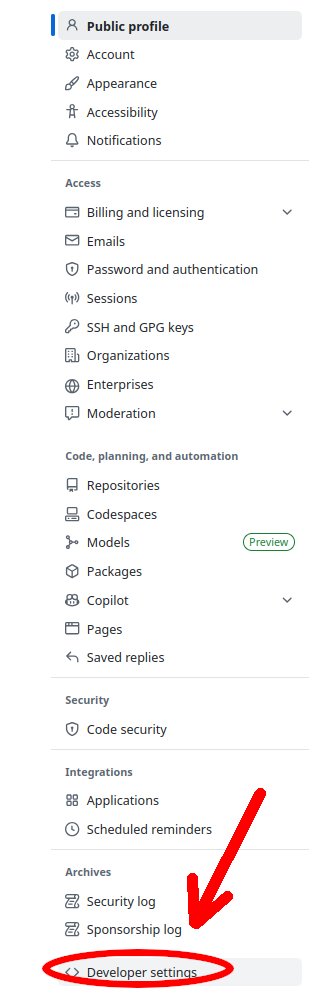
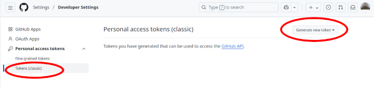
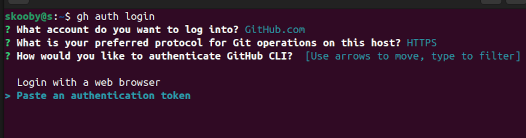
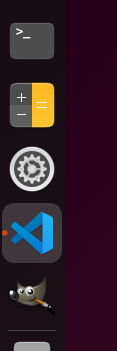
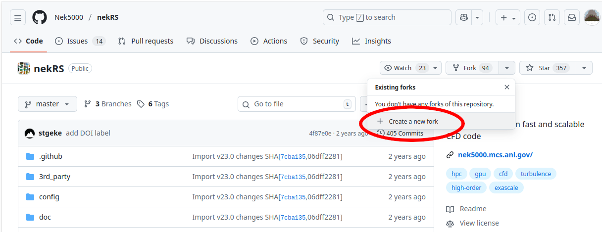
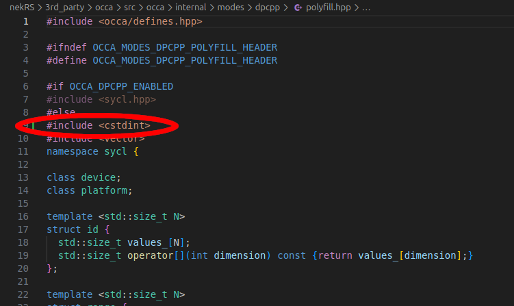
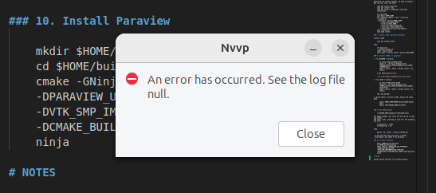

# Support Documentation for CUDA NekRS Installation on Ubuntu 24.04.3
    
These steps should work with most gaming and laptop PCs with an Nvidia GPU. 


### Potential Version Incompatibilies

Parts of the NekRS target the compute-70 (CUDA Version 7) architecture. According to their install guide, Hypre, one of NekRS's third party tools, is not considered compatible with Cuda Toolkit above version 11. There are references to some artifacts not found in the current version of the CUDA Toolkit. The NekRS build also uses flags which set the C++ standard to 11 for some nvcc compilations, and there are other flags, such as the OCCA environment flags, that are left empty, but could be configured to work in new ways during a future NekRS run.


<br /><br />
### 1. Install Ubuntu 24.04.3

1) Inside your Windows instance, download the Ubuntu 24.04.3 iso file

    Go to https://ubuntu.com/download/desktop and click the green button

2) Use Rufus (or Ventoy for multi-image usb sticks). Follow these directions:
  
    https://ubuntu.com/tutorials/create-a-usb-stick-on-windows

3) From your BIOS, boot from the USB drive and install to the target drive

    For this document, "Install latest Graphics and Wifi hardware drivers" was left blank during the install. 


<br /><br />
### 2. Install CUDA Drivers (if not pesent) and CUDA Toolkit (under version 13)


#### 1. Check or install CUDA Driver

Open a terminal and type:

```
nvidia-smi
```

If you have a driver already, you'll get back something like:

```
+-----------------------------------------------------------------------------------------+
| NVIDIA-SMI 570.172.08             Driver Version: 570.172.08     CUDA Version: 12.8     |
|-----------------------------------------+------------------------+----------------------+
| GPU  Name                 Persistence-M | Bus-Id          Disp.A | Volatile Uncorr. ECC |
| Fan  Temp   Perf          Pwr:Usage/Cap |           Memory-Usage | GPU-Util  Compute M. |
|                                         |                        |               MIG M. |
...
```

In the example, Driver Version is `570.172.08` and CUDA Version is `12.8`.

If you haven't installed a driver yet, in a terminal, type:

```
wget https://developer.download.nvidia.com/compute/cuda/repos/ubuntu2404/x86_64/cuda-keyring_1.1-1_all.deb
sudo dpkg -i cuda-keyring_1.1-1_all.deb
sudo apt update
sudo apt install nvidia-driver-580-open
```
After the driver is installed,

```
reboot
```        


#### 2. Install CUDA Toolkit (Under Version 13)

The difference between CUDA Version and Toolkit Version, even though they are usually the same numeric values on a given machine, is that the CUDA Version refers to the driver software running on a particular GPU device, often referred to as the `native` architecture in configuration tools, while the CUDA Toolkit Version determines what hardware architectures a given codebase on a machine can target.

To reiterate, the command to `apt install cuda-toolkit` will automatically install the latest CUDA Toolkit (v13) if that matches your CUDA driver version, but Nvidia ended targeting devices below CUDA Versions 7.5. This is a problem because some of NekRS's third party tools (Hypre, OCCA) expect the previous version (v11) of cusparse or similar deprecated CUDA tools. 

So if your driver's CUDA Version is 13, do this:

```
sudo apt install cuda-toolkit-12-8
```

However, if you have an older GPU and your Driver Version is under 13, you automatically get an older version of the Toolkit that is capable of targeting your device. In that case, just type:

```
sudo apt install cuda-toolkit 
```

Once this completes, make sure to update your path to nvcc:

```
echo export PATH=/usr/local/cuda/bin:$PATH >> ~/.bashrc
. ~/.bashrc
```

<br /><br />
### 3. Configure Environment, git, and Visual Studio Code

Install git

```
sudo apt install git gh
```

Create a personal access token to use with gh.

On github, go to your account's `Settings -> Developer Settings`



Then go to `Personal Acess Tokens -> Classic`



Create a classic token and paste that into a call to `gh auth login`



Configure git with your identity

```
git config --global user.name <your git name>
git config --global user.email <your git email>
```

Install Visual Studio Code

```
sudo snap install code --classic
```

Some suggested tools to pin to the Dash 
- Terminal
- Calculator
- Settings
- VS Code


<br /><br />
### 4. Install Open MPI

MPI is the program space NekRS is configured to run inside. For each Case in NekRS, a large set of objects and executables are essentially JIT compiled, using the tools MPI is configured to use for this. To use our CUDA hardware, we need to configure MPI to compile them using nvcc, along with the standard gnu tools. In Step 6, we will run NekRS with a call to `mpirun`, a tool generated in this step. 

Install gnu fortran, autoconf, cmake, flex, zlib, and some other dependencies

```       
sudo apt install autoconf cmake gfortran flex libtool zlib1g-dev liblz4-dev libzstd-dev
```

Clone the `open-mpi/ompi` repository

``` 
git clone --recursive https://github.com/open-mpi/ompi.git
```

Install Open-MPI

```
cd ompi
./autogen.pl
./configure --with-cuda=/usr/local/cuda --with-cuda-libdir=/usr/local/cuda/stubs 
make --j$(nproc)
sudo make install
```

Once the installation completes, export the location of its installed libraries to your environment

```
echo export LD_LIBRARY_PATH=/usr/local/lib >> ~/.bashrc     # add the changes to library path for every terminal
. ~/.bashrc                                                 # source the changes into this terminal window
```

<br /><br />
### 5. Install NekRS

Navigate to https://github.com/nek5000/nekRS and fork the NekRS repository. 



Clone your copy of NekRS:

```
git clone --recursive https://github.com/<your fork>/nekRS.git
```

For the next part, I had a small issue with one file, an OCCA file called `nekRS/src/3rd_party/occa/src/occa/internal/modes/dpcpp/polyfill.hpp`, so I added `#include <cstdint>` in its own line, just above line #9 in that file. 



    
The mpi commands are wrappers around the standard gnu tools. So rather than specify another set of `lib`, `include`, and `bin` folders every time an mpi program is compiled, we instead replace `CC` with `mpicc`, or `CXX` with `mpic++`, or `mpif77` for `f77`, etc, and the wrappers do the rest. We use this aliasing technique next.

```
cd nekRS
CC=mpicc CXX=mpic++ FC=mpif77 ./nrsconfig
```
    
Once it completes, export the home and path variables,

```
echo export NEKRS_HOME=~/.local/nekrs >> ~/.bashrc
echo export PATH=$NEKRS_HOME/bin:$PATH >> ~/.bashrc
. ~/.bashrc
```

<br /><br />
### 6. Get NekRS Output

Navigate to the build's `examples/turbPipePeriodic` folder:

```
cd $NEKRS_HOME/examples/turbPipePeriodic
```

Then

```    
mpirun -np 2 nekrs --setup turbPipe.par
```

<br /><br />
### 7. Install Paraview

```
sudo apt install paraview
```

<br /><br />
<br /><br />
### NekRS Examples Video Playlist

[](https://www.youtube.com/playlist?list=PLya1SvGKk6YahaFk3HIyiFsJiURsulj2r)

### REFERENCES

https://github.com/Nek5000

https://developer.nvidia.com/cuda-toolkit-archive

https://docs.nvidia.com/cuda/cuda-installation-guide-linux/

https://developer.nvidia.com/cuda-gpus

https://en.wikipedia.org/wiki/CUDA

https://forums.developer.nvidia.com/t/how-to-build-ucx-openmpi-pytorch-with-cuda-distributed-on-agx-orin/341027

https://docs.open-mpi.org/en/v5.0.x/tuning-apps/networking/cuda.html

https://stackoverflow.com/questions/28932864/which-compute-capability-is-supported-by-which-cuda-versions/28933055#28933055

### TEST SPECS

RTX 3090 Ti and RTX 5090 GPUs\
i9-12900KS chipset on an ASUS Z690 motherboard\
AMD Ryzen 7970X CPU on an ASUS Pro WS TRX50 Sage Wifi motherboard.

### NOTES

If your instance of Nvidia Visual Profiler is currently busted,



Type:

```
sudo apt install openjdk-8-jdk
```
Go to the `/usr/local/cuda/bin` folder and edit the `nvvp` file. Add the following before `'$@'` at the end of the file:

```
-vm /usr/lib/jvm/java-8-openjdk-amd64/jre/bin/java
```
