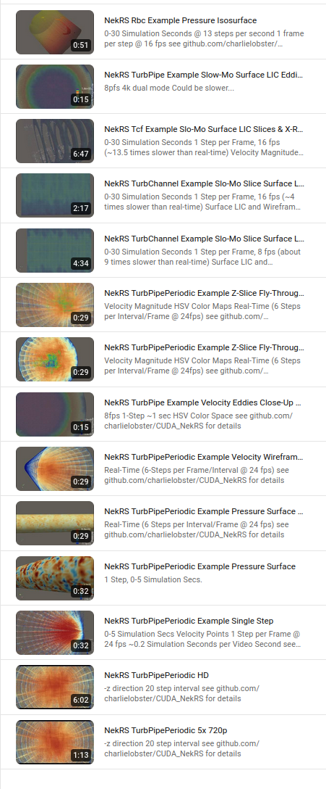
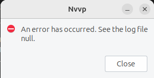

# Support Documentation for CUDA NekRS Installation on Ubuntu 24.04.3
    
These steps should work with most gaming and laptop PCs with an Nvidia GPU. 


### Potential Version Incompatibilies

Parts of the NekRS codebase target the compute-70 (CUDA Version 7) architecture. Hypre's installation instructions says it can't be used above Cuda Toolkit 11.8. There are portions of the code that reference some artifacts not found in the current version of the CUDA Toolkit. Parts of the NekRS build also use flags which set the C++ standard to 11, and other flags, such as the OCCA environment flags, that are left empty, but could be configured to work in new ways during a future NekRS run.


### 1. Install Ubuntu 24.04.3

1) Inside your Windows instance, download the Ubuntu 24.04.3 iso file

    Go to https://ubuntu.com/download/desktop and click the green button

2) Use Rufus (or Ventoy for multi-image usb sticks). Follow these directions:
  
    https://ubuntu.com/tutorials/create-a-usb-stick-on-windows

3) From your BIOS, boot from the USB drive and install to the target drive

    For this tutorial, "Install latest Graphics and Wifi hardware drivers" was left blank during the install. 


### 2. Install CUDA Drivers (if not pesent) and CUDA Toolkit (under version 13)


#### 1. Check or install CUDA Driver

1) Open a terminal and type:

    ```
    nvidia-smi
    ```

    If you have a driver already, you'll get back something like:

    ```
    +-----------------------------------------------------------------------------------------+
    | NVIDIA-SMI 570.172.08             Driver Version: 570.172.08     CUDA Version: 12.8     |
    |-----------------------------------------+------------------------+----------------------+
    | GPU  Name                 Persistence-M | Bus-Id          Disp.A | Volatile Uncorr. ECC |
    | Fan  Temp   Perf          Pwr:Usage/Cap |           Memory-Usage | GPU-Util  Compute M. |
    |                                         |                        |               MIG M. |
    ...
    ```

    In the example, Driver Version is 570.172.08 and CUDA Version is 12.8.

    There is a difference between CUDA Version and Toolkit Version, even though they are usually the same numeric values on given machine. The CUDA Version refers to the driver software you have running on a particular GPU device. Your CUDA Toolkit Version determines what hardware architectures a given codebase on your machine can target, which are not necessarily just your own architecture. 

3) If you haven't installed a driver yet, in a terminal, type:

    ```
    wget https://developer.download.nvidia.com/compute/cuda/repos/ubuntu2404/x86_64/cuda-keyring_1.1-1_all.deb
    sudo dpkg -i cuda-keyring_1.1-1_all.deb
    sudo apt update
    sudo apt install nvidia-driver-580-open
    ```
4) After the driver is installed,
   
    ```
    reboot
    ```        


#### 2. Install CUDA Toolkit (Under Version 13)

Just to reiterate, the command to `apt install cuda-toolkit` will automatically install the Version 13 CUDA Toolkit if that matches your CUDA driver's version, but Nvidia ended targeting devices below CUDA Versions 7.5 for this, their newest Toolkit. Some of NekRS's third party tools (Hypre) expect the previous version (v11) of cusparse. 

So if your driver's CUDA Version is 13, do this:

```
sudo apt install cuda-toolkit-12-8
```

However, if you have an older GPU and your Driver Version is under 13, you automatically get an older version of the Toolkit that is capable of targeting your device. 

In that case, just type:

```
sudo apt install cuda-toolkit 
```

Once this completes, make sure to update your path to nvcc:

```
echo export PATH=/usr/local/cuda/bin:$PATH >> ~/.bashrc
. ~/.bashrc
```


### 3. Configure Environment, git, and Visual Studio Code

1) Install git

    ```
    sudo apt install git gh
    ```

2) Create a personal access token to use with gh

    On your github.com home page, go to your account's 
    ```
    Settings -> Developer Settings -> Personal Acess Tokens -> Classic
    ```
    <picture of developer settings>
    <picture of classic token tab location>

   Create a classic token and paste that into a call to `gh auth login`

3) Configure git with your identity
    ```
    git config --global user.name <your git name>
    git config --global user.email <your git email>
    ```
3) Install Visual Studio Code

    ```
    sudo snap install code --classic
    ```
4) Pin the following tools to the Dash: 

    - VS Code
    - Terminal
    - Settings
    - Calculator
   <picture of Dash>


### 4. Install Open MPI

MPI is the program space NekRS is configured to actually run within. In Step 6, we will run NekRS with a call to `mpirun`, the tool generated in this step. 

1) Install gnu fortran, Flex, zlib, and some other dependencies

    ```       
    sudo apt install autoconf cmake gfortran flex libtool zlib1g-dev liblz4-dev libzstd-dev
    ```

2) clone the open-mpi repository:

    ``` 
    git clone --recursive https://github.com/open-mpi/ompi.git
    ```

3) Install open-mpi,

    ```
    cd ompi
    ./autogen.pl
    ./configure --with-cuda=/usr/local/cuda --with-cuda-libdir=/usr/local/cuda/stubs 
    make --j$(nproc)
    sudo make install
    ```

4) Once the installation completes, export the location of its installed libraries to your environment:

    ```
    echo export LD_LIBRARY_PATH=/usr/local/lib >> ~/.bashrc     # add the changes to library path for every terminal
    . ~/.bashrc                                                 # source the changes into this terminal window
    ```

### 5. Install NekRS

1) First navigate to https://github.com/nek5000/nekRS and fork the NekRS repository. 

<picture of forking Nek5000/NekRS on github>

2) Clone your copy of NekRS:

    ```
    git clone --recursive https://github.com/<your fork>/nekRS.git
    ```

3) Note that for the next part, I had a small issue with one file, an OCCA file called `nekRS/src/3rd_party/occa/src/occa/internal/modes/dpcpp/polyfill.hpp`, so I added `#include <cstdint>` in its own line, just above line #9 in that file. 

<picture of change to polyfill.hpp in vs code>

    The mpi commands are wrappers around the standard gnu tools. So rather than require yet another set of `lib`, `include`, and `bin` folders every time an mpi program is compiled, we can replace `CC` with `mpicc`, or `CXX` with `mpic++`, or `mpif77` for `f77`, etc. We will use this aliasing technique next.

    ```
    cd nekRS
    CC=mpicc CXX=mpic++ FC=mpif77 ./nrsconfig
    ```
    
4) Once it completes, export the home and path variables,

    ```
    echo export NEKRS_HOME=~/.local/nekrs >> ~/.bashrc
    echo export PATH=$NEKRS_HOME/bin:$PATH >> ~/.bashrc
    . ~/.bashrc
    ```

### 6. Get NekRS Output

1) Navigate to the build's `examples/turbPipePeriodic` folder:

    ```
    cd $NEKRS_HOME/examples/turbPipePeriodic
    ```

2) If the nekRS example .par files are not set up to save any output. 

    In `turbPipe.par`, change the endTime from 200 to .5 for a shorter test time. 

    ```
    endTime = .5
    ```

3) Then, starting at line 8, add or change these lines in the `turbPipe.par` file:

    ```
    writeControl = steps
    writeInterval = 6 
    ```

4) Then type,

    ```    
    mpirun -np 2 nekrs --setup turbPipe.par
    ```

### 7. Install Paraview

```
sudo apt install paraview
```

### NekRS Examples Video Playlist

[](https://www.youtube.com/playlist?list=PLya1SvGKk6YahaFk3HIyiFsJiURsulj2r)

# REFERENCES

https://github.com/Nek5000

https://developer.nvidia.com/cuda-toolkit-archive

https://docs.nvidia.com/cuda/cuda-installation-guide-linux/

https://developer.nvidia.com/cuda-gpus

https://en.wikipedia.org/wiki/CUDA

https://forums.developer.nvidia.com/t/how-to-build-ucx-openmpi-pytorch-with-cuda-distributed-on-agx-orin/341027

https://docs.open-mpi.org/en/v5.0.x/tuning-apps/networking/cuda.html

https://stackoverflow.com/questions/28932864/which-compute-capability-is-supported-by-which-cuda-versions/28933055#28933055

# TEST SPECS

RTX 3090 Ti and RTX 5090 GPUs\
i9-12900KS chipset on an ASUS Z690 motherboard\
AMD Ryzen 7970X CPU on an ASUS Pro WS TRX50 Sage Wifi motherboard.

# NOTES

If your instance of Nvidia Visual Profiler is currently busted,



Type:

```
sudo apt install openjdk-8-jdk
```
Go to the `/usr/local/cuda/bin` folder and edit the `nvvp` file. Add the following before `'$@'` at the end of the file:

```
-vm /usr/lib/jvm/java-8-openjdk-amd64/jre/bin/java
```
